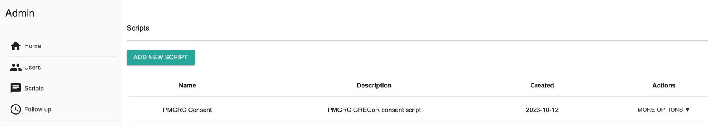
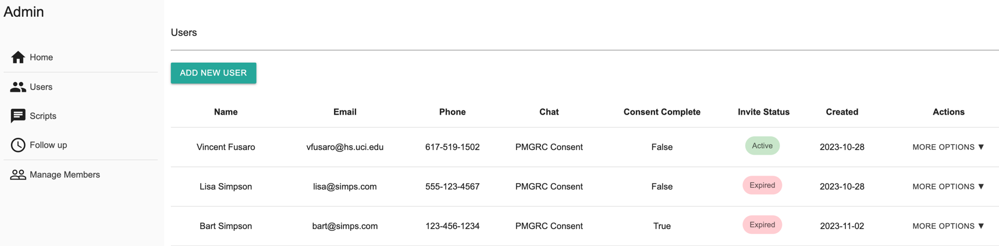
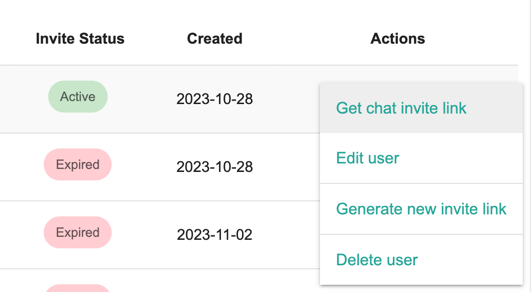
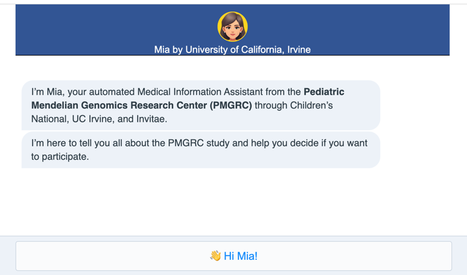

## Install & Setup
* These instructions are for MacOS (Windows is possible but slightly different)
* Download and install PostgreSQL (v16)
  * Configure PostgreSQL settings and create a database called `mia_app` and `test_db` 
  * You might want a database explorer tool like pgAdmin 4
* git clone the repo
* create the virtual environment
```python
# create the virtual environment
python3 -m venv venv

# activate virtual environment
source venv/bin/activate

# pip install the requirements
pip3 install -r requirements.txt

# initialize the database
flask db init
```
Next create an admin user
```python
# launch ipython and create an admin login account
ipython -i setup_ipython.py

In [1]: member = Members(full_name='John Smith', email='jsmith@hs.uci.edu', password='#SomethingSuperSecure')

In [2]: db.session.add(member)

In [3]: db.session.commit()
```

## Run the application (in a new tab)
```python 
source venv/bin/activate
python mia.py

# go to the admin page and login
http://127.0.0.1:5000/admin/
```
## How to use the application
### 1. Create a script
First create a script that you can assign to users. The application comes with a consent script 
JSON file to get started.
```python
http://127.0.0.1:5000/admin/scripts/
```
Click `Add New Script` and provide the name "PMGRC Consent" with a description "PMGRC GREGoR consent script"


Launch ipython
```python
# launch ipython and create an admin login account
ipython -i setup_ipython.py

In [4]: _replace_db_script_with_json('PMGRC Consent', 'PMGRC Consent.json')
```
This will load the current consent script into the database.

### 2. Create users
Navigate to the `Users` and click `Add New User`
```python
http://127.0.0.1:5000/admin/users/
```


### 3. Get the user invite link
Click on `More Options` and select `Get chat invite link`. Copy the link and paste it into a new browser tab.



Start the consent chat


## Developer Information
### Run the tests
```python
# from the project directory
source venv/bin/activate
pytest
```

### Databse migrations
* Initialize the migration database (one time only)
```python
flask db init
```
* create a migration script everytime you later your database 
models.
```python
flask db migrate -m "Your message here"
```
* Upgrade the database (apply the migration script)
```python
flask db upgrade
```

### Interact with the database manually
```python
# launch an ipython session with access to all the models
ipython -i setup_ipython.py
```